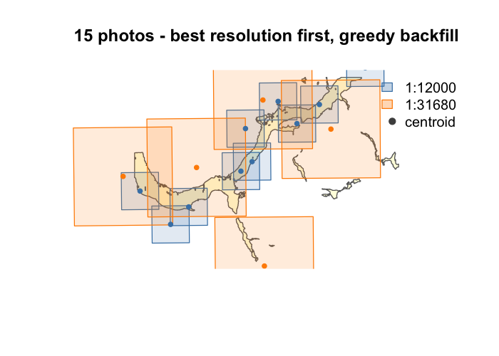

# fly 

**F**ootprints from **L**egacy aerial photograph**Y**

<!-- badges: start -->
<!-- badges: end -->

A toolkit for working with British Columbia's historic aerial photography — from finding the frames that cover your study area to turning them into map-ready georeferenced images.

## Why

Historic airphotos are essential for documenting landscape change, but they're awkward to work with. Photo centroids are available from the [BC Data Catalogue](https://catalogue.data.gov.bc.ca/dataset/0af7544c-f2ad-4553-bb37-889c94d4c571), but the catalogue gives you a point and a scale — not a footprint. So you can't tell which of thousands of overlapping frames across multiple scales and decades actually cover your area of interest, and the scanned images aren't georeferenced.

fly estimates each photo's ground footprint from its scale and film format, then uses those footprints to filter, select, download, and georeference the photos you need.



*Upper Bulkley River floodplain near Houston, BC — 1968 photos at 1:12,000 (blue) and 1:31,680 (orange).*

## What it does

- **Estimate footprints** — turn centroids and scale into ground-coverage rectangles (`fly_footprint`)
- **Explore** — summarize available photos by scale and year, and measure coverage and frame-to-frame overlap (`fly_summary`, `fly_coverage`, `fly_overlap`)
- **Select** — keep only photos whose footprint covers your area of interest, then take the fewest needed (best resolution first) or every frame touching it (`fly_filter`, `fly_select`)
- **Fetch** — download thumbnails, flight logs, and camera calibration reports from the BC Data Catalogue, optionally in parallel (`fly_fetch`)
- **Georeference** — warp the scanned images onto their estimated footprints as GeoTIFFs (BC Albers), with automatic flight-line rotation, for film and digital frames alike (`fly_bearing`, `fly_georef`)

## Installation

```r
pak::pak("NewGraphEnvironment/fly")
```

## Example

```r
library(fly)
library(sf)

# Keep photos whose footprint overlaps the AOI (not just the centroid)
filtered <- fly_filter(centroids, aoi, method = "footprint")

# Fewest photos to reach 95% coverage, best resolution first
selected <- fly_select(filtered, aoi, mode = "minimal", target_coverage = 0.95)

# Download thumbnails, then georeference them to their footprints
fetched  <- fly_fetch(selected, type = "thumbnail", dest_dir = "thumbs")
fly_georef(fetched, selected, dest_dir = "georef", rotation = "auto")
```

Full walkthrough at the [airphoto selection vignette](https://newgraphenvironment.github.io/fly/articles/airphoto-selection.html), and the [function reference](https://newgraphenvironment.github.io/fly/reference/) for details.

## Used by

[`stac_airphoto_bc`](https://github.com/NewGraphEnvironment/stac_airphoto_bc) builds on fly to publish georeferenced historic airphoto thumbnails for BC as a public [STAC](https://stacspec.org/) collection, served at [images.a11s.one](https://images.a11s.one). fly does the footprint estimation, downloading, and georeferencing; that pipeline adds Cloud-Optimized GeoTIFF conversion, S3 storage, and STAC cataloguing.

## Related packages

- [flooded](https://github.com/NewGraphEnvironment/flooded) — delineate floodplain extents from DEMs and stream networks to generate AOI polygons
- [drift](https://github.com/NewGraphEnvironment/drift) — land cover change detection from satellite imagery; fly adds longer-term historic airphoto context
- [fresh](https://github.com/NewGraphEnvironment/fresh) — FWA/bcfishpass database queries (DB functions previously in fly moved here in v0.2.0)
