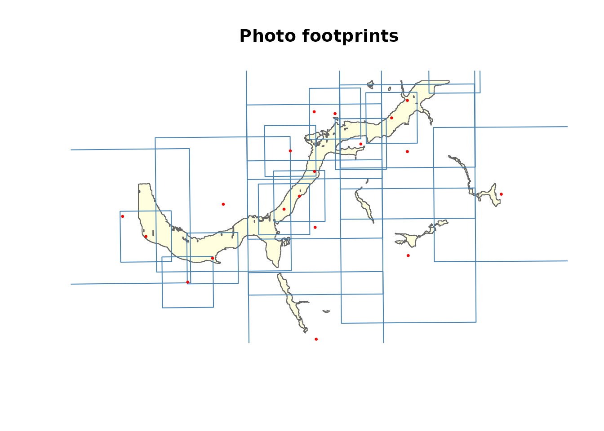
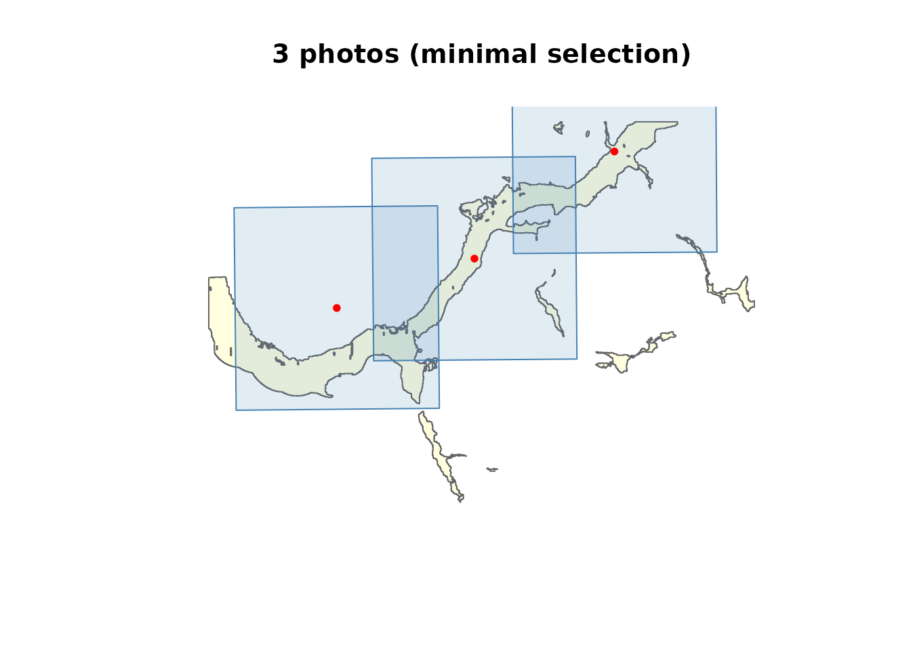
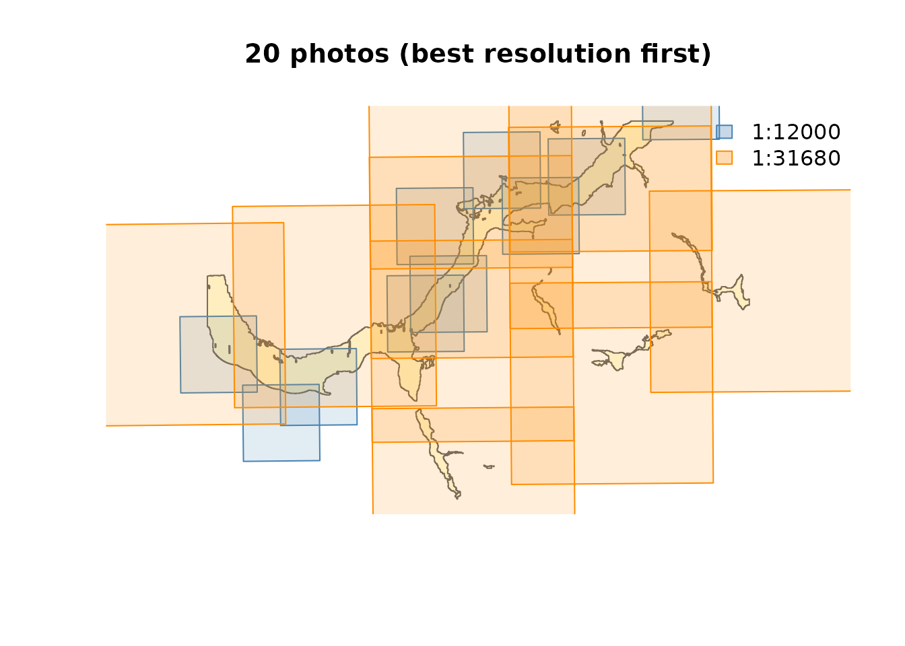

# Airphoto Selection Pipeline

This vignette demonstrates the full `fly` pipeline using bundled test
data from the Upper Bulkley River floodplain near Houston, BC. The data
includes 1968 airphoto centroids at two scales (1:12,000 and 1:31,680).

``` r
library(fly)
library(sf)
#> Linking to GEOS 3.12.1, GDAL 3.8.4, PROJ 9.4.0; sf_use_s2() is TRUE

centroids <- st_read(system.file("testdata/photo_centroids.gpkg", package = "fly"), quiet = TRUE)
aoi <- st_read(system.file("testdata/aoi.gpkg", package = "fly"), quiet = TRUE)
```

## Footprint estimation

[`fly_footprint()`](https://newgraphenvironment.github.io/fly/reference/fly_footprint.md)
converts point centroids into rectangular polygons representing
estimated ground coverage. The standard 9” x 9” (228 mm) negative used
by BC aerial survey cameras produces a footprint width of
`9 * scale * 0.0254` metres. The 9x9 format is the default
(`negative_size = 9`) and is correct for standard BC catalogue
photography. The full BC Air Photo Database records camera focal length
per roll, but this field is not available in the simplified centroid
data — override `negative_size` if working with non-standard format
photography.

Note that footprints assume flat terrain beneath the aircraft. On slopes
the true ground coverage differs — downhill slopes produce a larger
actual footprint, uphill slopes a smaller one. All coverage and overlap
numbers downstream inherit this approximation.

``` r
footprints <- fly_footprint(centroids)
plot(st_geometry(aoi), col = "lightyellow", border = "grey40", main = "Photo footprints")
plot(st_geometry(footprints), border = "steelblue", add = TRUE)
plot(st_geometry(centroids), pch = 20, cex = 0.5, col = "red", add = TRUE)
```



## Spatial filtering

[`fly_filter()`](https://newgraphenvironment.github.io/fly/reference/fly_filter.md)
with `method = "footprint"` catches photos whose centroid falls outside
the AOI but whose footprint overlaps it — a common situation with
large-scale photos at the edge of the study area.

``` r
fp_result <- fly_filter(centroids, aoi, method = "footprint")
ct_result <- fly_filter(centroids, aoi, method = "centroid")
cat("Footprint method:", nrow(fp_result), "photos\n")
#> Footprint method: 20 photos
cat("Centroid method: ", nrow(ct_result), "photos\n")
#> Centroid method:  7 photos
```

## Summary statistics

[`fly_summary()`](https://newgraphenvironment.github.io/fly/reference/fly_summary.md)
reports footprint dimensions and date ranges by scale.

``` r
fly_summary(centroids)
#> # A tibble: 2 × 6
#>   scale   photos footprint_m half_m year_min year_max
#>   <chr>    <int>       <dbl>  <dbl>    <int>    <int>
#> 1 1:12000     10        2743   1372     1968     1968
#> 2 1:31680     10        7242   3621     1968     1968
```

## Coverage analysis

[`fly_coverage()`](https://newgraphenvironment.github.io/fly/reference/fly_coverage.md)
computes what percentage of the AOI is covered by photo footprints,
grouped by any column.

``` r
fly_coverage(centroids, aoi, by = "scale")
#> Spherical geometry (s2) switched off
#> Spherical geometry (s2) switched on
#> # A tibble: 2 × 4
#>   scale   n_photos covered_km2 coverage_pct
#>   <chr>      <int>       <dbl>        <dbl>
#> 1 1:12000       10        15.1         60.7
#> 2 1:31680       10        24.8        100
```

## Photo selection

[`fly_select()`](https://newgraphenvironment.github.io/fly/reference/fly_select.md)
has two modes:

- `mode = "minimal"` — fewest photos to reach target coverage
- `mode = "all"` — every photo whose footprint touches the AOI

### Minimal selection

``` r
selected <- fly_select(centroids, aoi, mode = "minimal", target_coverage = 0.80)
#> Spherical geometry (s2) switched off
#> Selecting photos (target: 80% coverage)...
#>   3 photos -> 81.6% coverage
#> Selected 3 of 20 photos for 81.6% coverage
#> Spherical geometry (s2) switched on
selected[, c("airp_id", "scale", "selection_order", "cumulative_coverage_pct")]
#> Simple feature collection with 3 features and 4 fields
#> Geometry type: POINT
#> Dimension:     XY
#> Bounding box:  xmin: -126.6796 ymin: 54.41035 xmax: -126.5269 ymax: 54.46049
#> Geodetic CRS:  WGS 84
#>    airp_id   scale selection_order cumulative_coverage_pct
#> 11  697358 1:31680               1                    41.0
#> 20  697329 1:31680               2                    66.5
#> 12  697292 1:31680               3                    81.6
#>                          geom
#> 11 POINT (-126.6796 54.41035)
#> 20 POINT (-126.6039 54.42617)
#> 12 POINT (-126.5269 54.46049)
```

``` r
sel_fp <- fly_footprint(selected)
plot(st_geometry(aoi), col = "lightyellow", border = "grey40",
     main = paste(nrow(selected), "photos (minimal selection)"))
plot(st_geometry(sel_fp), border = "steelblue", col = adjustcolor("steelblue", 0.15), add = TRUE)
plot(st_geometry(selected), pch = 20, col = "red", add = TRUE)
```



### All photos touching AOI

``` r
all_in_aoi <- fly_select(centroids, aoi, mode = "all")
#> Spherical geometry (s2) switched off
#> although coordinates are longitude/latitude, st_union assumes that they are
#> planar
#> although coordinates are longitude/latitude, st_intersects assumes that they
#> are planar
#> Selected 20 of 20 photos intersecting the AOI
#> Spherical geometry (s2) switched on
cat(nrow(all_in_aoi), "photos intersect the AOI\n")
#> 20 photos intersect the AOI
```

## Overlap analysis

[`fly_overlap()`](https://newgraphenvironment.github.io/fly/reference/fly_overlap.md)
reports pairwise overlap between photo footprints. Run it on same-scale
subsets to understand coverage quality.

``` r
photos_12k <- centroids[centroids$scale == "1:12000", ]
overlap_12k <- fly_overlap(photos_12k)
#> Spherical geometry (s2) switched off
#> Spherical geometry (s2) switched on
overlap_12k
#> # A tibble: 7 × 5
#>   photo_a photo_b overlap_km2 pct_of_a pct_of_b
#>     <int>   <int>       <dbl>    <dbl>    <dbl>
#> 1  699370  699365       2.05      27.2     27.2
#> 2  699370  699373       0.134      1.8      1.8
#> 3  699426  699425       3.92      52.1     52.1
#> 4  699396  699393       0.246      3.3      3.3
#> 5  699396  699421       1.5       19.9     19.9
#> 6  699419  699421       1.46      19.4     19.4
#> 7  699425  699393       0.676      9        9
```

``` r
if (nrow(overlap_12k) > 0) {
  cat("1:12000 overlap range:",
      round(min(overlap_12k$pct_of_a), 1), "% -",
      round(max(overlap_12k$pct_of_a), 1), "%\n")
}
#> 1:12000 overlap range: 1.8 % - 52.1 %

photos_31k <- centroids[centroids$scale == "1:31680", ]
overlap_31k <- fly_overlap(photos_31k)
#> Spherical geometry (s2) switched off
#> Spherical geometry (s2) switched on
if (nrow(overlap_31k) > 0) {
  cat("1:31680 overlap range:",
      round(min(overlap_31k$pct_of_a), 1), "% -",
      round(max(overlap_31k$pct_of_a), 1), "%\n")
}
#> 1:31680 overlap range: 1.9 % - 61.7 %
```

## Multi-scale workflow: best resolution first

In practice you want the finest-scale photos first, then fill gaps with
coarser scales. Sort scales finest-first by parsing the numeric
denominator:

``` r
sf_use_s2(FALSE)
#> Spherical geometry (s2) switched off

# Sort scales finest-first
scales <- sort(unique(as.numeric(gsub("1:", "", centroids$scale))))
cat("Scales (finest first):", paste0("1:", scales), "\n")
#> Scales (finest first): 1:12000 1:31680

target_coverage <- 0.80
aoi_albers <- st_transform(aoi, 3005) |> st_union() |> st_make_valid()
aoi_area <- as.numeric(st_area(aoi_albers))
selected_all <- NULL
remaining_aoi <- aoi_albers

for (sc_num in scales) {
  sc <- paste0("1:", sc_num)
  photos_sc <- centroids[centroids$scale == sc, ]
  if (nrow(photos_sc) == 0) next

  # Take all photos at this scale that touch the (remaining) AOI
  remaining_sf <- st_sf(geometry = st_geometry(remaining_aoi)) |>
    st_transform(4326) |> st_make_valid()
  sel <- fly_select(photos_sc, remaining_sf, mode = "all")
  if (nrow(sel) == 0) next

  # Update remaining uncovered area
  fp <- fly_footprint(sel) |> st_transform(3005)
  fp_union <- st_union(fp) |> st_make_valid()
  remaining_aoi <- tryCatch(
    st_difference(remaining_aoi, fp_union) |> st_make_valid(),
    error = function(e) remaining_aoi
  )
  remaining_area <- as.numeric(st_area(remaining_aoi))
  covered_pct <- 1 - sum(remaining_area) / aoi_area

  cat(sc, ":", nrow(sel), "photos (cumulative coverage:",
      round(covered_pct * 100, 1), "%)\n")

  sel$priority_scale <- sc
  selected_all <- rbind(selected_all, sel)

  if (covered_pct >= target_coverage) break
}
#> although coordinates are longitude/latitude, st_union assumes that they are
#> planar
#> although coordinates are longitude/latitude, st_intersects assumes that they
#> are planar
#> Selected 10 of 10 photos intersecting the AOI
#> Spherical geometry (s2) switched on
#> 1:12000 : 10 photos (cumulative coverage: 60.7 %)
#> Spherical geometry (s2) switched off
#> although coordinates are longitude/latitude, st_union assumes that they are
#> planar
#> although coordinates are longitude/latitude, st_intersects assumes that they
#> are planar
#> Selected 10 of 10 photos intersecting the AOI
#> Spherical geometry (s2) switched on
#> 1:31680 : 10 photos (cumulative coverage: 100 %)

cat("\nTotal:", nrow(selected_all), "photos\n")
#> 
#> Total: 20 photos
as.data.frame(table(selected_all$priority_scale))
#>      Var1 Freq
#> 1 1:12000   10
#> 2 1:31680   10
```

``` r
sel_fp <- fly_footprint(selected_all)
plot(st_geometry(aoi), col = "lightyellow", border = "grey40",
     main = paste(nrow(selected_all), "photos (best resolution first)"))
scale_labels <- sort(unique(selected_all$priority_scale))
palette <- c("steelblue", "darkorange", "forestgreen", "firebrick")
cols <- palette[match(selected_all$priority_scale, scale_labels)]
for (j in seq_len(nrow(sel_fp))) {
  plot(st_geometry(sel_fp[j, ]), border = cols[j],
       col = adjustcolor(cols[j], 0.15), add = TRUE)
}
legend("topright", legend = scale_labels,
       fill = adjustcolor(palette[seq_along(scale_labels)], 0.3),
       border = palette[seq_along(scale_labels)], bty = "n")
```


