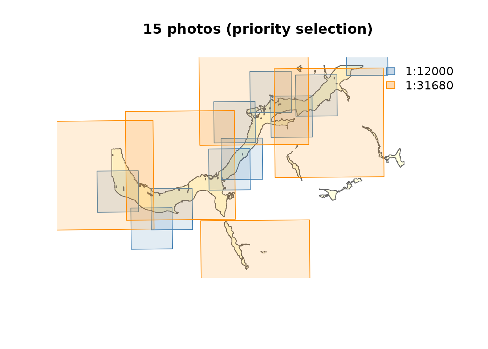

# Airphoto Selection Pipeline

This vignette demonstrates the full `fly` pipeline using bundled test
data from the Neexdzii Kwa (Morice River) floodplain near Houston, BC.
The data includes 1968 airphoto centroids at two scales (1:12,000 and
1:31,680).

``` r
library(fly)
library(sf)
#> Linking to GEOS 3.12.1, GDAL 3.8.4, PROJ 9.4.0; sf_use_s2() is TRUE

centroids <- st_read(system.file("testdata/photo_centroids.gpkg", package = "fly"), quiet = TRUE)
aoi <- st_read(system.file("testdata/aoi.gpkg", package = "fly"), quiet = TRUE)
```

## Footprint estimation

[`fly_footprint()`](https://newgraphenvironment.github.io/fly/reference/fly_footprint.md)
converts point centroids into rectangular polygons representing
estimated ground coverage. The standard 9” x 9” negative produces a
footprint width of `9 * scale * 0.0254` metres.

``` r
footprints <- fly_footprint(centroids)
plot(st_geometry(aoi), col = "lightyellow", border = "grey40", main = "Photo footprints")
plot(st_geometry(footprints), border = "steelblue", add = TRUE)
plot(st_geometry(centroids), pch = 20, cex = 0.5, col = "red", add = TRUE)
```


## Spatial filtering

[`fly_filter()`](https://newgraphenvironment.github.io/fly/reference/fly_filter.md)
with `method = "footprint"` catches photos whose centroid falls outside
the AOI but whose footprint overlaps it — a common situation with
large-scale photos at the edge of the study area.

``` r
fp_result <- fly_filter(centroids, aoi, method = "footprint")
ct_result <- fly_filter(centroids, aoi, method = "centroid")
cat("Footprint method:", nrow(fp_result), "photos\n")
#> Footprint method: 20 photos
cat("Centroid method: ", nrow(ct_result), "photos\n")
#> Centroid method:  7 photos
```

## Summary statistics

[`fly_summary()`](https://newgraphenvironment.github.io/fly/reference/fly_summary.md)
reports footprint dimensions and date ranges by scale.

``` r
fly_summary(centroids)
#> # A tibble: 2 × 6
#>   scale   photos footprint_m half_m year_min year_max
#>   <chr>    <int>       <dbl>  <dbl>    <int>    <int>
#> 1 1:12000     10        2743   1372     1968     1968
#> 2 1:31680     10        7242   3621     1968     1968
```

## Coverage analysis

[`fly_coverage()`](https://newgraphenvironment.github.io/fly/reference/fly_coverage.md)
computes what percentage of the AOI is covered by photo footprints,
grouped by any column.

``` r
fly_coverage(centroids, aoi, by = "scale")
#> Spherical geometry (s2) switched off
#> Spherical geometry (s2) switched on
#> # A tibble: 2 × 4
#>   scale   n_photos covered_km2 coverage_pct
#>   <chr>      <int>       <dbl>        <dbl>
#> 1 1:12000       10        15.1         60.7
#> 2 1:31680       10        24.8        100
```

## Greedy photo selection

[`fly_select()`](https://newgraphenvironment.github.io/fly/reference/fly_select.md)
picks the minimum set of photos needed to reach a target coverage, using
a greedy set-cover algorithm that iteratively selects the photo covering
the most uncovered area.

``` r
selected <- fly_select(centroids, aoi, target_coverage = 0.80)
#> Spherical geometry (s2) switched off
#> Selecting photos (target: 80% coverage)...
#>   3 photos -> 81.6% coverage
#> Selected 3 of 20 photos for 81.6% coverage
#> Spherical geometry (s2) switched on
selected[, c("airp_id", "scale", "selection_order", "cumulative_coverage_pct")]
#> Simple feature collection with 3 features and 4 fields
#> Geometry type: POINT
#> Dimension:     XY
#> Bounding box:  xmin: -126.6796 ymin: 54.41035 xmax: -126.5269 ymax: 54.46049
#> Geodetic CRS:  WGS 84
#>    airp_id   scale selection_order cumulative_coverage_pct
#> 11  697358 1:31680               1                    41.0
#> 20  697329 1:31680               2                    66.5
#> 12  697292 1:31680               3                    81.6
#>                          geom
#> 11 POINT (-126.6796 54.41035)
#> 20 POINT (-126.6039 54.42617)
#> 12 POINT (-126.5269 54.46049)
```

``` r
sel_fp <- fly_footprint(selected)
plot(st_geometry(aoi), col = "lightyellow", border = "grey40",
     main = paste(nrow(selected), "photos selected (greedy)"))
plot(st_geometry(sel_fp), border = "steelblue", col = adjustcolor("steelblue", 0.15), add = TRUE)
plot(st_geometry(selected), pch = 20, col = "red", add = TRUE)
```


## Priority selection: best resolution first

In practice you often want **all** photos at the best available
resolution, then backfill uncovered area with coarser scales. This
combines
[`fly_select()`](https://newgraphenvironment.github.io/fly/reference/fly_select.md)
with a priority loop over scales.

``` r
sf_use_s2(FALSE)
#> Spherical geometry (s2) switched off
scales_priority <- c("1:12000", "1:31680")
target_coverage <- 0.80

aoi_albers <- st_transform(aoi, 3005) |> st_union() |> st_make_valid()
aoi_area <- as.numeric(st_area(aoi_albers))
selected_all <- NULL
remaining_aoi <- aoi_albers

for (i in seq_along(scales_priority)) {
  sc <- scales_priority[i]
  photos_sc <- centroids[centroids$scale == sc, ]
  if (nrow(photos_sc) == 0) next

  if (i == 1) {
    # Best resolution: take ALL photos
    cat(sc, ": taking all", nrow(photos_sc), "photos\n")
    sel <- photos_sc
    sel$selection_order <- seq_len(nrow(sel))
    sel$cumulative_coverage_pct <- NA_real_
  } else {
    # Coarser scales: greedy select on remaining uncovered area
    remaining_sf <- st_sf(geometry = st_geometry(remaining_aoi)) |>
      st_transform(4326) |> st_make_valid()
    sel <- fly_select(photos_sc, remaining_sf, target_coverage = target_coverage)
  }

  if (nrow(sel) > 0) {
    fp <- fly_footprint(sel) |> st_transform(3005)
    fp_union <- st_union(fp) |> st_make_valid()
    remaining_aoi <- tryCatch(
      st_difference(remaining_aoi, fp_union) |> st_make_valid(),
      error = function(e) remaining_aoi
    )
    covered_pct <- 1 - as.numeric(st_area(remaining_aoi)) / aoi_area
    cat("  -> ", nrow(sel), " photos at ", sc,
        " (cumulative: ", round(covered_pct * 100, 1), "%)\n")
    sel$priority_scale <- sc
    selected_all <- rbind(selected_all, sel)
  }
}
#> 1:12000 : taking all 10 photos
#>   ->  10  photos at  1:12000  (cumulative:  60.7 %)
#> Selecting photos (target: 80% coverage)...
#>   5 photos -> 87.7% coverage
#> Selected 5 of 10 photos for 87.7% coverage
#> Spherical geometry (s2) switched on
#>   ->  5  photos at  1:31680  (cumulative:  95.2 %)

cat("\nTotal:", nrow(selected_all), "photos\n")
#> 
#> Total: 15 photos
as.data.frame(table(selected_all$priority_scale))
#>      Var1 Freq
#> 1 1:12000   10
#> 2 1:31680    5
```

``` r
sel_fp <- fly_footprint(selected_all)
plot(st_geometry(aoi), col = "lightyellow", border = "grey40",
     main = paste(nrow(selected_all), "photos (priority selection)"))
# Color by scale
cols <- ifelse(selected_all$priority_scale == "1:12000", "steelblue", "darkorange")
border_cols <- cols
fill_cols <- adjustcolor(cols, 0.15)
for (j in seq_len(nrow(sel_fp))) {
  plot(st_geometry(sel_fp[j, ]), border = border_cols[j],
       col = fill_cols[j], add = TRUE)
}
legend("topright", legend = scales_priority,
       fill = adjustcolor(c("steelblue", "darkorange"), 0.3),
       border = c("steelblue", "darkorange"), bty = "n")
```


